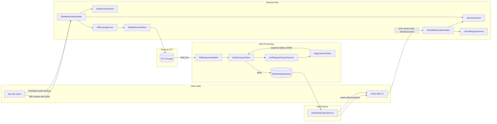
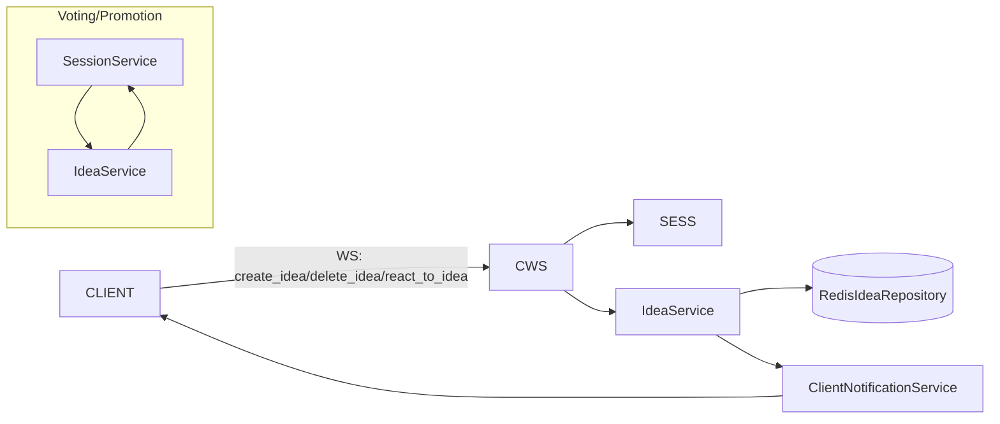
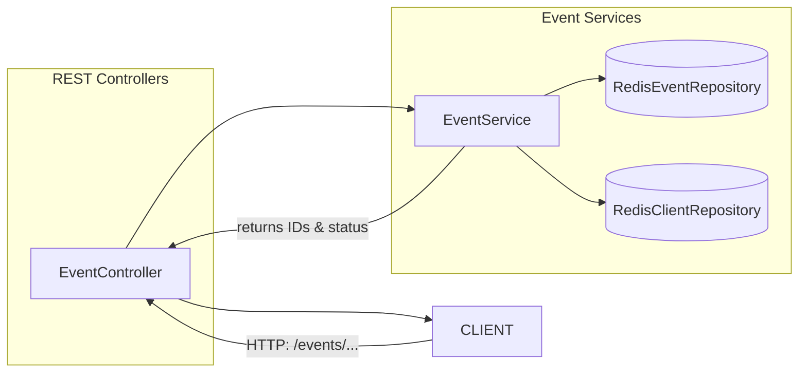
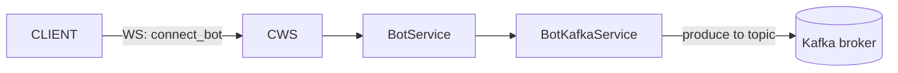

# Data Flow Overview

This document outlines the logical flow of data in the project: how inputs arrive, how they’re processed, and where outputs go. It reflects the current code paths in WebSocket handlers, STT/LLM services, Redis repositories, REST controllers, and Kafka integrations.

See also the extended diagram set in [docs/DIAGRAMS.md](DIAGRAMS.md).

## Real-Time Audio → STT → LLM → Ideas → Clients

- Client connects via WebSocket to `ClientWebSocketHandler` and is registered in `SessionService`; `ClientRegistryService` maps `clientId` to `conferenceId`, `eventId`, and `conferenceName` for later STT-originated messages.
- Bot connects via `BotWebSocketHandler`; audio frames (PCM16LE) are relayed through `SttRoutingService` and `SttWebSocketClient` to the external STT provider. Audio can be optionally captured in `AudioDumpService`.
- External STT returns `final_text`. `SttResponseHandler` resolves the client’s conference by `clientId` via `ClientRegistryService`, then triggers `IdeaService` through `IdeaExtractorClient`.
- `IdeaExtractorClient` builds requests using `LlmRequestFactoryService` and calls `GigaChatLlmClient`. The LLM responds with ideas (JSON), which are parsed into domain `Idea` objects.
- `IdeaService` converts ideas to Redis models, persists via `RedisIdeaRepository`, and uses `ClientNotificationService` to broadcast updates to participants (conference-wide or event-wide).

## Client-Initiated Idea Actions

- `create_idea`: `ClientWebSocketHandler` calls `IdeaService.createIdeaFromFront()`, which saves to Redis and broadcasts to the conference.
- `delete_idea`: `ClientWebSocketHandler` calls `IdeaService.deleteIdea()`; broadcast emits `idea_deleted` to event participants.
- `react_to_idea`: `ClientWebSocketHandler` calls `IdeaService.reactToIdea()`; likes/dislikes update and broadcast via `ClientNotificationService`. If likes exceed 50% of participants in the conference based on `SessionService`, the idea is promoted to `GLOBAL` and broadcast event-wide.

## Event Lifecycle (REST)

- `POST /events/create`: Creates `eventId`, `conferenceId`, and `clientId`; persists event and participant; maps `clientId` → `conferenceId` in Redis.
- `POST /events/{eventId}/join`: Joins or creates a conference under the event; generates a new `clientId`; updates Redis mappings.
- `POST /events/{eventId}/end`: Deletes the event and (TODO) broadcasts termination.
- `GET /events/{eventId}/summary`: Placeholder (TODO) to aggregate event summary.

## Bot Provisioning (Kafka)

- Client requests bot connection through WebSocket (`connect_bot`). `BotService` links the bot to the client’s conference and emits a connect command to Kafka via `BotKafkaService`.

## Key Message Types

- Incoming WS from clients: `vote`, `create_idea`, `delete_idea`, `react_to_idea`, `connect_bot`, `disconnect_bot`.
- STT inbound: `final_text` with `clientId` and transcribed text.
- Outbound notifications: `idea`, `idea_deleted`, `idea_reaction`, `idea_status_changed`, `ideas_list`, `participants_count`, `bot_connected`, `bot_disconnected`.

## Persistence

- Ideas: value at `idea:{ideaId}`, sets for event-scoped status (`event:{eventId}:ideas:pending|accepted|rejected`).
- Events/participants: event entity and sets for participants; conference names; `clientId → conferenceId,eventId` mapping.

## Notes

- Audio routing currently uses a WebSocket to external STT and supports audio dump toggled by `app.debug.audio-dump.enabled`.
- LLM provider is GigaChat via `GigaChatLlmClient`; requests are built with `LlmRequestFactoryService`.
- Broadcasting excludes source conference for event-wide messages where appropriate.
