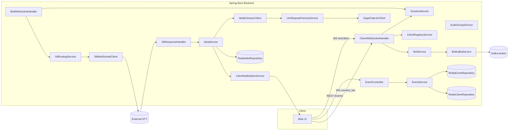
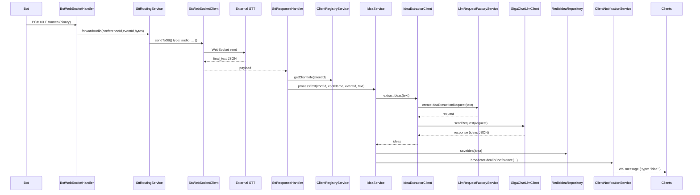
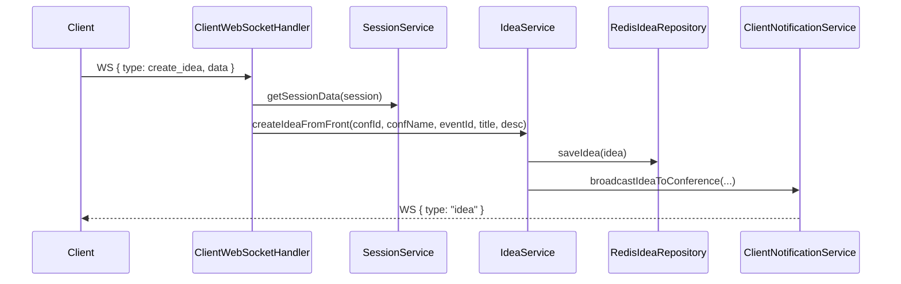
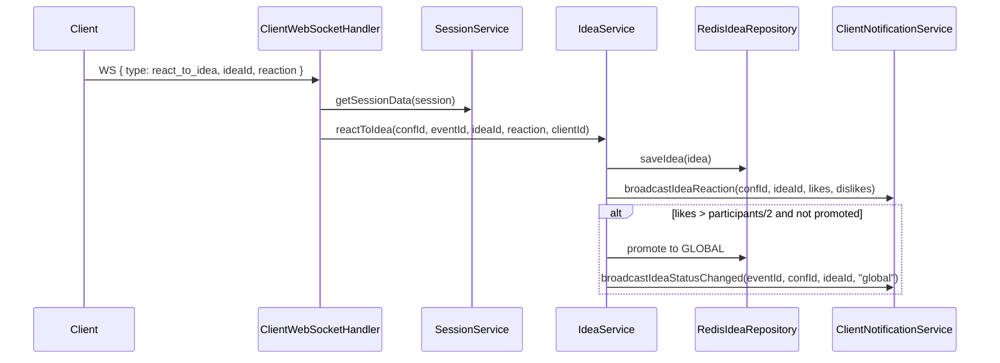
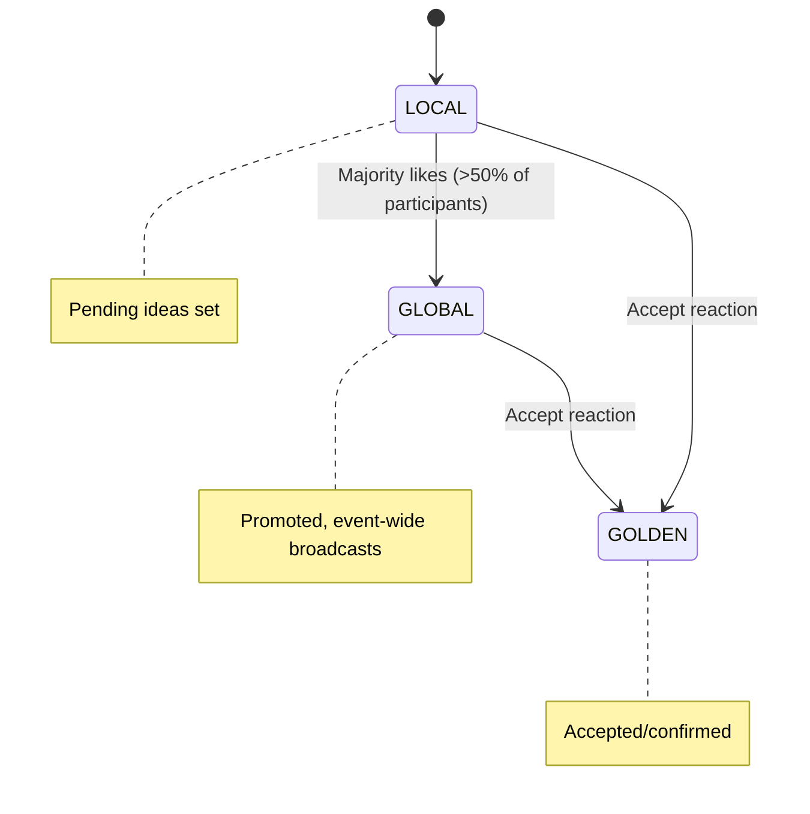
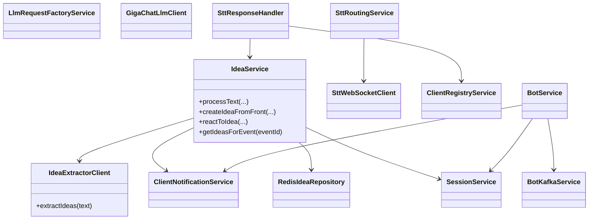
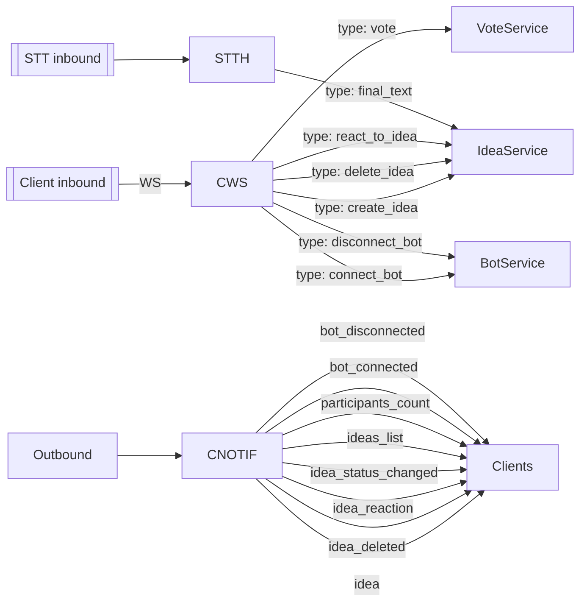
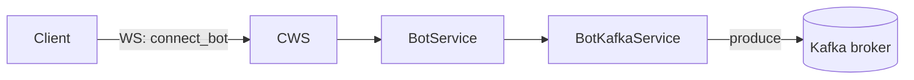
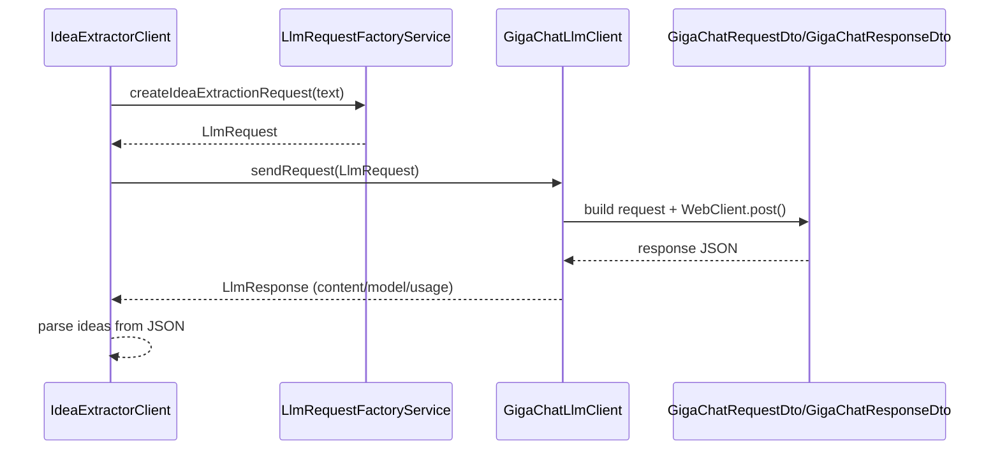

# Diagrams Index
## PNG Exports

- [Architecture](diagrams/png/architecture.png)
- [Data Flow: Real-Time](diagrams/png/data_flow_realtime.png)
- [WS Message Types](diagrams/png/ws_message_types.png)
- [Sequence: Bot Audio → STT → LLM](diagrams/png/sequence_bot_audio.png)
- [Sequence: Client Create Idea](diagrams/png/sequence_client_create_idea.png)
- [Sequence: React and Promotion](diagrams/png/sequence_react_promotion.png)
- [State: Idea Lifecycle](diagrams/png/state_idea_lifecycle.png)
- [Class Relationships](diagrams/png/class_relations.png)
- [Redis Key Schema](diagrams/png/redis_schema.png)
- [REST Endpoints](diagrams/png/rest_endpoints.png)
- [Kafka Bot Provisioning](diagrams/png/kafka_bot_provisioning.png)
- [STT Reconnect & Backpressure](diagrams/png/stt_reconnect.png)
- [Session Management](diagrams/png/session_management.png)
- [LLM Request/Response](diagrams/png/llm_request_response.png)

A collection of Mermaid diagrams capturing key flows and structures in the backend.

## System Architecture



## Sequence: Bot Audio → STT → LLM → Ideas Broadcast



## Sequence: Client Create Idea



## Sequence: React and Promotion



## State: Idea Lifecycle



## Class Relationships



## Redis Key Schema Overview

```mermaid
flowchart TD
  subgraph Redis
    I[idea:{ideaId} -> Idea]
    P[event:{eventId}:ideas:pending -> Set(ideaId)]
    A[event:{eventId}:ideas:accepted -> Set(ideaId)]
    R[event:{eventId}:ideas:rejected -> Set(ideaId)]
    E[event:{eventId} -> Event]
    EP[event:{eventId}:participants -> Set(conferenceId)]
    CNF[conference:{conferenceId}:name -> String]
    CCM[client:{clientId} -> { conferenceId, eventId }]
  end

  I --- P
  I --- A
  I --- R
  E --- EP
  CNF --> E
  CCM --> CNF
```

## WebSocket Message Types



## REST Endpoints Map

```mermaid
flowchart TD
  Client -->|POST /events/create| EC[EventController]
  EC --> ES[EventService]
  ES --> REDIS_EVENT
  ES --> REDIS_CLIENT

  Client -->|POST /events/{eventId}/join| EC
  EC --> ES
  ES --> REDIS_EVENT
  ES --> REDIS_CLIENT

  Client -->|POST /events/{eventId}/end| EC
  EC --> ES
  ES --> REDIS_EVENT

  Client -->|GET /events/{eventId}/summary| EC
  EC --> ES
```

## Kafka Bot Provisioning



## STT Reconnection & Backpressure

```mermaid
flowchart TD
  STTWS[SttWebSocketClient]
  STTWS -->|outQueue (Sinks.Many)| Sender
  STTWS -->|ReactorNetty client.execute| Connection
  Connection -->|retryWhen(backoff)| Reconnect
  Reconnect --> STTWS
  Connection -->|on receive| STTH[SttResponseHandler]
  Note[Backoff resets on successful connect]
```

## Session Management (connect/disconnect)

```mermaid
sequenceDiagram
  participant Client
  participant CWS as ClientWebSocketHandler
  participant REDIS as RedisClientRepository / RedisEventRepository
  participant CREG as ClientRegistryService
  participant SESS as SessionService
  participant NOTIF as ClientNotificationService

  Client->>CWS: WS connect with clientId,eventId
  CWS->>REDIS: fetch conferenceId, conferenceName
  CWS->>CREG: registerClient(clientId, conferenceId, eventId, name)
  CWS->>SESS: registerClient(session, clientId, ...)
  CWS->>NOTIF: broadcastParticipantsCount(conferenceId, count)
  ...
  Client--xCWS: WS disconnect
  CWS->>CREG: unregisterClient(clientId)
  CWS->>SESS: unregisterClient(session)
  CWS->>NOTIF: broadcastParticipantsCount(conferenceId, count)
```

## LLM Request/Response



---

If you want PNG/SVG exports or additional deep-dive sequence diagrams (e.g., voting edge cases, STT error handling), let me know which to prioritize.
